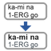

# LingTeX-Word User Guide

*Interlinear glossed text in Microsoft Word: aligned, numbered, and wrapped to the page for you.*

## What LingTeX-Word does

Linguists present example sentences as interlinear glossed text: the words of
the language on one line, a gloss under each word, and a free translation
underneath. In a word processor that alignment is fragile. A tab stop moves,
a font changes, the margins change, and every column slides.

LingTeX-Word draws each example as a **borderless Word table**, one column per
alignment slot and one row per tier, and takes care of the rest:

- The example **wraps to the page**. When it is too wide, columns move down
  onto a second line, each form still directly above its gloss; when there is
  room again they move back up.
- It **re-wraps by itself** when the document is saved and when you leave an
  example after editing it, and on demand from the ribbon.
- Grammatical glosses (`ERG`, `3SG`, `PST`) are set in **small capitals**, the
  way the Leipzig Glossing Rules print them.
- Examples are **numbered** with Word's own numbering, so they renumber when
  one is deleted or moved, and cross-references can point at them.
- The glossing is **checked** against the conventions, and what has one right
  answer is repaired for you.

Everything it draws is ordinary Word: tables, paragraph styles, list
numbering. There is nothing hidden in the file, so the document reads and
prints the same on a machine without the add-in.

### One idea to hold on to

A column is an **alignment slot**, not a word. A column can hold a whole word,
a single morpheme, or part of a word, and one example may mix all three: you
can split one clitic out into a column of its own and leave the rest of the
sentence word-aligned. Two rules follow, and the add-in keeps both for you:

1. **No spaces inside a cell.** A space would let Word wrap the text inside
   the cell and break the alignment. Use `.` or `_` instead; a space you type
   is replaced with the character the document is set to.
2. **Break characters agree down a column.** If a cell begins with `-` or `=`,
   every other cell in that column does too, so a split-off suffix reads `-xa`
   over `-DIST`, never `-xa` over `DIST`. A column that begins with a break
   character is a continuation of the one before it, and a wrap line never
   starts there.

The free translation is prose and is exempt from both.

## Installing

LingTeX-Word is one file, `LingTeX-Word.dotm`, a Word template that lives in
Word's Startup folder and loads at every start. Once it is there, every
document has an **Interlinear** tab on the ribbon. **Close Word before you
install.**

### Windows

1. Run `LingTeX-Word-Setup-...exe`. It is unsigned, so SmartScreen says
   "unknown publisher": choose *More info*, then *Run anyway*. It copies the
   template into `%APPDATA%\Microsoft\Word\STARTUP` and registers an
   uninstaller under Settings > Apps.
2. Start Word. A message says LingTeX-Word is installed and lists its
   keyboard shortcuts (**Ctrl+Alt+Shift** and a letter). The Interlinear tab
   is on the ribbon.

The `-windows.zip` holds the same template with `install.bat`, for anyone who
prefers to see what the installer does. To remove the add-in, go to
Settings > Apps > LingTeX-Word > Uninstall, or delete the file from the
STARTUP folder.

### Mac

1. Unzip the `-macos.zip`.
2. Double-click `install.command`. If macOS refuses to open it, right-click
   it and choose *Open*. It copies the template into Word's Startup folder
   and clears the download quarantine.
3. Start Word. If Word asks whether to enable macros in `LingTeX-Word.dotm`,
   choose **Enable Macros**. A message then says LingTeX-Word is installed and
   lists its keyboard shortcuts (**Cmd+Option+Shift** and a letter). The
   Interlinear tab is on the ribbon.

To remove the add-in, run `sh install.sh --uninstall` from the unzipped
folder, or delete `LingTeX-Word.dotm` from Word's Startup folder.

### Upgrading

Close Word and run the new installer; it replaces the file. Documents made
with an earlier version keep working, and re-wrap with the new one.

## The Interlinear tab

Every command is on one tab. The same commands are in Word's macro list
(Alt+F8 on Windows, Tools > Macro > Macros on Mac) under the names in the
right-hand column, for anyone who prefers that.

### Interlinear

| Button | What it does | Macro name |
|---|---|---|
|  **Insert Interlinear** | With nothing selected, reads the clipboard (FLEx interlinear text or plain tab-separated rows); with text selected, replaces it, and selected lines you typed take the Text to Interlinear road. | `LingTeXInsertInterlinear` |
|  **Convert Table** | Adopts an ordinary Word table as an auto-wrapping example: one row per tier, a row merged into one cell as the translation. | `LingTeXConvertTableToIgt` |
|  **Text to Interlinear** | Turns selected lines of text into an example: the words on one line, their glosses on the next, the translation under them. | `LingTeXTextToInterlinear` |

### Layout

| Button | What it does | Macro name |
|---|---|---|
|  **Re-wrap All** | Re-wraps every example in the document. Also runs when the document is saved. | `LingTeXRewrapAll` |
|  **Re-wrap This** | Re-wraps the example at the cursor, from scratch: columns move down when space has run out and back up when it has been freed. | `LingTeXRewrapCurrent` |
|  **Indent** | Moves the example half an inch to the right, number and translation with it, and re-wraps it to the narrower line. | `LingTeXIndentExample` |
|  **Outdent** | Moves it half an inch back. Stops at the margin. | `LingTeXOutdentExample` |

### Alignment

| Button | What it does | Macro name |
|---|---|---|
|  **Split Column** | Splits the column at the cursor at its first morpheme boundary, on every tier at once, carrying the break character onto the new column. | `LingTeXSplitColumn` |
|  **Merge Columns** | Select across several cells to merge exactly those; with the cursor in one cell, merges that column with the next. | `LingTeXMergeColumns` |

### Settings (toggles)

These show the active document's setting and flip it. By Word, By Morpheme
and Numbers apply to **new** examples; an example already on the page is
unchanged until it is inserted again. First Capital applies to every example
at its next re-wrap, which with the defaults is the next save.

| Button | What it sets | Macro name |
|---|---|---|
|  **By Word** | One column per word. Enclitics stay in their host's column. | `LingTeXAlignByWord` |
|  **By Morpheme** | One column per morpheme. A column that continues a word never starts a wrap line. | `LingTeXAlignByMorpheme` |
|  **Re-wrap on Save** | Re-wrap every example when the document is saved. On by default. | `LingTeXToggleRewrapOnSave` |
|  **Re-wrap on Leave** | Re-wrap an example as soon as the cursor leaves it. On by default; it never fires while you type inside one. | `LingTeXToggleRewrapOnSelectionChange` |
|  **Numbers** | Number new examples (1), (2)... in a first column. | `LingTeXToggleExampleNumbers` |
|  **First Capital** | Grammatical glosses as `Erg`, `3Sg`, with a full-size first capital; off, uniform small capitals as the Leipzig rules print them. | `LingTeXToggleGramGlossInitialCap` |

### Setup, Keys and Check

| Button | What it does | Macro name |
|---|---|---|
|  **Settings** | Opens the Settings dialog: alignment, numbering, small capitals, the re-wrap triggers, every spacing, and the LingTeX styles. | `LingTeXSettings` |
|  **Reset Styles** | Makes the six tier styles follow the document's Normal style again, and re-wraps. Asks first. | `LingTeXResetStyles` |
|  **Install Shortcuts** | Binds every command to a key; done once on the first start, and again here if the bindings are lost. | `LingTeXInstallShortcuts` |
|  **Shortcuts** | Lists the shortcuts actually bound on this machine. | `LingTeXShowShortcuts` |
|  **Check Glossing** | Checks the example at the cursor against the glossing conventions and offers to repair what has one right answer. | `LingTeXCheckExample` |

## Getting an example onto the page

### From FLEx

In FieldWorks Language Explorer, select the interlinear text you want, copy
it, click in your Word document where the example should go, and click
**Insert Interlinear**. The tiers FLEx copies (word, morphemes, lexical
gloss, word gloss, word category, free translation) are recognised by their
labels, in either spelling. By default the example is aligned by word, with
enclitics kept in their host's column; **By Morpheme** gives one column per
morpheme instead.

If FLEx copied several examples at once, the first is inserted.

### From a table

An ordinary Word table, typed by hand or pasted from a spreadsheet, becomes an
example with **Convert Table**: click anywhere in it. One row per tier, in
order (the words first, then their glosses); a row that has been merged into
a single cell is taken as the free translation.

### From lines you typed

For an example that exists only as text, select the lines and click **Text to
Interlinear**:

```
(1) Uwzob zu. [...] Ozwum-vex zu vuz-mo ov vrezo, zovemi vexu muvuze.

Lantern DET [...] Cord-3.POSS DET thin.SG-and can make.thin, what-PP touches.something if

(Bebas: Lampu minyak itu. Talinya itu tipis dan bisa kasi tipis kalau dia sentuh sesuatu.)
```

The words of each tier line become the columns. Any run of spaces separates
them, a manual line break inside a line is just a space, and blank lines are
skipped. A leading example number such as `(1)`, `(12a)` or `1.` is dropped,
because the document numbers its examples itself.

The one thing the text cannot say is which of its last lines are free
translations, so you are asked. The question lists every line with its word
count and offers a guess: the trailing lines whose word count differs from
the first line's. Accept it or type the number, or Cancel to draw nothing.

With the document set to **By Morpheme**, every column in which every filled
tier cell carries a morpheme boundary is split at it, on every tier, so
`Ozwum-vex` over `Cord-3.POSS` becomes two columns while `zovemi` over
`what-PP` stays one (an empty cell does not stand in the way). Check Glossing
reports that mismatch afterwards, as it always has.

**Insert Interlinear** takes the same road when its *selection* is plain
lines rather than FLEx text or tab-separated rows; from the clipboard it
expects FLEx text or tab-separated rows.

## Working with an example

**Editing cells.** Click in a cell and type. The example re-wraps when the
cursor leaves it (and when the document is saved), so a longer form pushes
columns down and a shorter one pulls them back up. If you type a space inside
a cell it becomes `.` or `_`, whichever the document is set to, at the next
re-wrap: a space would break the alignment.

**Splitting and merging.** Put the cursor in a cell and click **Split Column**
to pull an affix, a clitic or a reduplicant out into a column of its own; the
break character goes onto the start of the new column on every tier, so the
column rule above holds by construction. **Merge Columns** puts columns back
together. You can leave one word morpheme-aligned in an otherwise
word-aligned example.

**Moving it.** **Indent** and **Outdent** step the whole example, number and
translation included, by half an inch; dragging the table's left edge on the
ruler works too, and a re-wrap keeps whatever indent it finds. A new example
takes the indent of the paragraph it is inserted into.

**Undo.** One Undo takes back a whole insert or re-wrap.

**Deleting an example.** Select the table and the translation under it and
delete them as you would any table. The next example renumbers.

**Letting go of an example.** Every example carries the table style `LingTeX
Interlinear`; that style is how the add-in knows a table is its own. Apply any
other table style and the add-in leaves that table alone from then on.

## Numbering

A new example carries its number in a first column, `(1)`, `(2)`..., set by
Word's own list numbering (the list style *LingTeX Example Number*). Because
it is an ordinary numbered paragraph, everything Word does with numbering
applies: delete or move an example and the rest renumber; a cross-reference
can point at it; the list style decides its format.

**Numbers** on the ribbon decides only whether *new* examples get a number;
an example keeps its number through every re-wrap. The width of the number
column is a setting (36 pt by default).

**Per chapter.** Modify the list style *LingTeX Example Number* in Word's
own style dialog (Format > Style on Mac, the Styles pane on Windows; set its
list to *All styles* to see it): link its level 1 to Heading 1 with no number
text, put `(%2)` on level 2 with no trailing character and a text position of
0, and set the list level to 2 in the Settings dialog. New examples then sit
on level 2, which Word restarts after every Heading 1. (The *Example Number*
entry in the Settings dialog's Styles list is the paragraph style of the
number cell, not this list style.)

## The Settings dialog

**Settings** opens one dialog over every setting the document holds. Settings
are stored **in the document**, so a colleague who opens the file with the
add-in gets the same layout, and a document keeps its choices when it moves
between machines.

**New examples:** one column per word or per morpheme; whether they are
numbered, and on which list level; grammatical glosses in small capitals,
and whether with a full-size first capital; the two re-wrap triggers; and
what a space typed inside a cell becomes.

**Spacing,** one box per spacing, by level. A box takes points (`6`) or a
percentage of the example's font size (`50%` is half a line, and grows with
the text). **An empty box means the default**, shown in brackets after the
box's name.

| Row | Box | What it sets | Default |
|---|---|---|---|
| Example | Before | Space above the example, on its first row | 0 |
| | After | Space after the translation, or after the last row when there is none | 3 |
| | Left | Left indent of every new example | the indent of the paragraph it is inserted into |
| | Right | How far short of the right margin the wrap lines and translation stop | 0 |
| Wrap lines | Line gap | Space between the wrap lines of an example | 6 |
| | Continuation | Extra indent of every wrap line after the first | 0 |
| | Tier gap | Space between the tiers of one wrap line | 0 |
| Columns | Column gap | Space to the right of every column's widest cell | 6 |
| | Number column | Width of the number column | 36 |
| Cell padding | Left, Right, Top, Bottom | Padding inside every cell; the columns widen to match, and the text stays at the example's indent | 0 |
| Translation | Above | Space between the last row and the first translation | 6 |
| | Between | Space between two translations | 0 |

**OK** stores the settings and re-wraps every example in the document so the
page shows the change; **Apply** does the same and leaves the dialog open;
**Cancel** stores nothing. **Restore Defaults** puts every box and tick back
to what a fresh document gets, stored only when you then press OK or Apply. A
box that is not a number is refused by name before anything is stored.

**Styles** lists the add-in's eight styles. Select one and click **Modify in
Word** to open Word's own style dialog on it, for everything a style can
hold: font, size, colour, borders, the paragraph format. **Reset This Style**
puts one style back to what a fresh document gets, following the Normal
style; **Reset the Six Tier Styles** does the tier styles together.

## Styles

Every example is described by ordinary Word styles, which is what makes it
survive a copy, a paste and a round trip through another editor. Restyle one
and every example in the document follows on its next re-wrap.

| Style | What it formats |
|---|---|
| LingTeX Vernacular | The word line: the object language, italic by default |
| LingTeX Morphemes | The morpheme line, when FLEx supplies one; italic by default |
| LingTeX Gloss | The morpheme glosses |
| LingTeX Word Gloss | The word glosses |
| LingTeX Category | The word categories |
| LingTeX Free | The free translation |
| LingTeX Gram Gloss | A character style: the grammatical abbreviations, in small capitals |
| LingTeX Example | The number cell |
| LingTeX Interlinear | The table style that marks a table as an example |

The tier styles are based on the document's Normal style and inherit its
size, so making the body text bigger makes the examples bigger on their next
re-wrap. Their font is pinned from the body font when they are created. To
change the font of the examples, change it on the styles, through Modify in
Word; a font with full phonetic coverage, such as Charis SIL or Doulos SIL,
keeps a row from growing when a symbol has to be borrowed from another font.

## Glossing conventions and Check Glossing

Grammatical glosses are recognised by their **shape**: all capitals, or
beginning with a digit. There is no list of approved abbreviations, so an
abbreviation nobody has published is still a grammatical gloss and still gets
small capitals. The Leipzig list is examples, not a vocabulary.

Word's small capitals only affect lower-case letters, so the add-in stores
`ERG` as `erg` in the Gram Gloss style and lets the style draw it as small
capitals. Nothing is lost: the style marks exactly which runs were
transformed, and the text reads back as `ERG`. **First Capital** keeps the
first letter full-size (`Erg`, `3Sg`); off, the glosses are uniform small
capitals, as the Leipzig rules print them.

**Check Glossing** reports what can be decided mechanically and repairs only
what has one right answer:

| Finding | Repaired? |
|---|---|
| A column where only some cells carry the break character | Yes |
| A space inside an interlinear cell | Yes, with `.` or `_` |
| Two cells in a column claiming different break characters | No: only the linguist knows which |
| Form and gloss showing a different number of morpheme breaks | No: reported |
| An unmatched infix bracket | No: reported |
| A column filled on some tiers and not others | No: legal, but usually a slip |

`.` and `:` are never counted as morpheme breaks: they mark one morpheme
glossed with several words, so `stack.CMP=SEQ` against `rixu=xo` is correct
and is not flagged.

## Keyboard shortcuts

On the first start the add-in binds every command to **Ctrl+Alt+Shift** and a
letter (Windows) or **Cmd+Option+Shift** and a letter (Mac). It never takes a
key that already does something in Word, so a command may land on an
alternate letter; **Shortcuts** lists what is actually bound on your machine,
and **Install Shortcuts** runs the installation again if the bindings are
lost.

| Command | Letters tried, in order |
|---|---|
| Insert Interlinear | I, E, J |
| Re-wrap This | R |
| Re-wrap All | A |
| Split Column | S, X, D |
| Merge Columns | M |
| Check Glossing | K |
| Convert Table | T |
| By Word | W |
| By Morpheme | P |
| Settings | H |
| Numbers | N |
| Indent | G |
| Outdent | L, O, U, Y, Q |
| Text to Interlinear | F, B, V |

## When something goes wrong

**"LingTeX-Word is busy with another operation."** A command was interrupted
and left a flag set. Run `LingTeXStart` from the macro list, or restart Word.

**"That text could not be read as interlinear data."** Insert Interlinear
expects FLEx text, tab-separated rows, or lines of plain text. Select the
lines and try Text to Interlinear, which asks about the translation lines.

**A style of the wrong kind.** If the document already has a style called,
say, *LingTeX Gloss* that is not a paragraph style, the add-in says so and
draws nothing until it is renamed or deleted: it would otherwise draw
examples it could not read back.

**Re-wrap All takes a few seconds** on a document with many examples. The
status bar reports progress; the second run is faster, because measured
widths are remembered.

**The Interlinear tab is missing.** The template is not loaded. Check that
`LingTeX-Word.dotm` is in Word's Startup folder, that macros are enabled for
it, and on Windows that Word's Trust Center allows macros in templates from
the Startup folder.

**Reporting a problem.** LingTeX-Word is part of LingTeX Tools, at
[github.com/rulingAnts/LingTeX-Tools](https://github.com/rulingAnts/LingTeX-Tools).
Open an issue there with the version from the title of this guide, your
platform, and, where you can, the text of the example.
